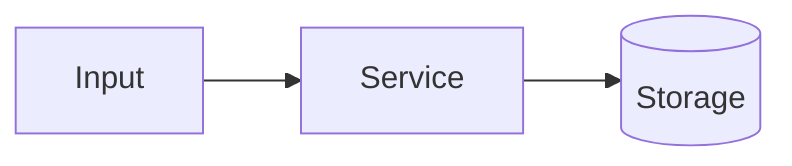

# PROJECT_NAME


One paragraph: what this is, who it is for, and what makes it technically interesting.

## What it does

- List only what is actually implemented.

## Architecture



More detail in [docs/architecture.md](docs/architecture.md).

## Key engineering decisions

- The decision, and why it was made.

## Tech stack

Python 3.13, FastAPI, pytest, GitHub Actions

## Getting started

```bash
cd backend
python -m venv .venv
source .venv/bin/activate        # Windows: .venv\Scripts\Activate.ps1
pip install -r requirements.txt
cp .env.example .env
pytest -v
uvicorn app.main:app --reload    # API docs at http://127.0.0.1:8000/docs
```

## Usage

Commands and examples.

## Project structure

- `backend/app/api/` - API routes
- `backend/app/core/` - configuration
- `backend/tests/` - tests
- `docs/architecture.md` - architecture notes
- `docs/build-log.md` - dev log

## Limitations

- What is not modeled or not supported yet.

## Roadmap

- Next milestones.

## Author

Built by Breijon Peters. The [dev log](docs/build-log.md) records every milestone: what was built, why, what broke and what was learned.
